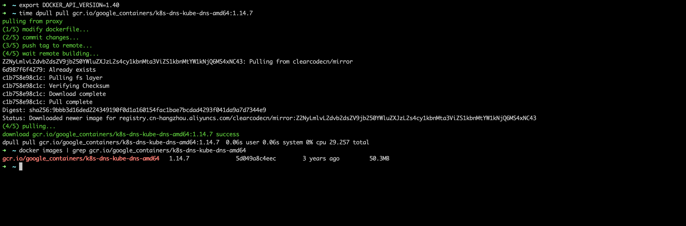

# dpull 镜像拉取工具

加速你的 `docker pull`



### 安装 
```yaml
go get -u github.com/clearcodecn/cmd/dpull
```

国内高速下载
[https://gitee.com/wocaa/dpull/releases](https://gitee.com/wocaa/dpull/releases)


### 使用

1. 初始化
```yaml
dpull init
```

2. 拉取
```yaml
dpull pull nginx   # 使用官方仓库镜像时 默认不走代理
dpull pull gcr.io/google_containers/kube-scheduler-amd64:v1.9.0  #使用镜像加速 
```

3. 注意事项
* 本项目不推荐在生产环境使用，生产环境最好是使用官方渠道拉取
* 更推荐使用自行搭建环境下载，请看[自行搭建教程](./docs/build_your_self.md)
* 本项目由于使用共有仓库性质，**无法保证镜像安全性**，切勿在生产环境使用